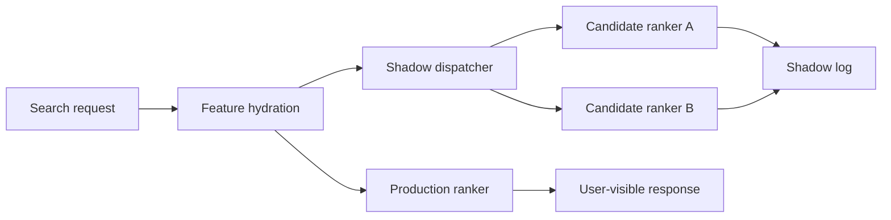

# Design Doc: Ranker Shadow Traffic

## Background

Meridian Ads uses a learned ranker to choose which sponsored listings appear in search result slots. The current production ranker is stable, but experimentation velocity is constrained by the cost of online canaries. A ranker candidate must pass offline evaluation, then receive a small percentage of live traffic, then wait for enough user actions to prove that it did not regress revenue, relevance, or latency. This process is safe, but it serializes too many experiments.

The ranking team wants a shadow-traffic system that evaluates candidate rankers on live requests without affecting user-visible results. The system should replay the feature set used by production ranking, call one or more candidate rankers, log comparable outputs, and produce diagnostic reports. The output should help engineers detect feature skew, latency risk, and obvious relevance regressions before a candidate enters a canary.

Shadow traffic is not a substitute for online experimentation. It is a filter that reduces the number of weak candidates entering canary and gives engineers better evidence about why a model behaves differently from production.

## Goals

The primary goal is to run candidate rankers against a representative sample of live search requests with no impact on user-visible ranking. The system should support at least five concurrent candidates, each receiving the same request payload that production ranking received after feature hydration.

The second goal is to provide comparable logs. For a given request id, analysts should be able to inspect production top results, candidate top results, score distributions, missing features, and latency. The logs should preserve enough context to debug ranking differences without storing raw query text longer than the existing retention policy allows.

The third goal is operational safety. Candidate failures must not affect the production ranker path. Shadow execution should be bounded by CPU, memory, and network budgets, and it should degrade by dropping shadow calls rather than slowing the user request.

## Non-Goals

This design does not define the ranking model architecture. It does not change production slot allocation, auction logic, or pricing. It does not attempt to infer causal business impact from shadow logs because users do not see candidate results. It also does not replace canary experiments, guardrail monitoring, or human relevance review.

The first launch will not support arbitrary user-defined transformations of feature payloads. Candidate rankers must consume the same schema version as production or register an explicit compatibility adapter.

## Overview

The system adds a shadow dispatcher after production feature hydration and before response finalization. The dispatcher receives the immutable ranking payload and asynchronously fans it out to candidate ranker endpoints. Candidate responses are written to a separate log stream keyed by request id. A daily analyzer joins production and shadow outputs and emits reports.



The shadow dispatcher runs on the request path but does not block the production response. It has a strict enqueue budget. If the dispatcher cannot enqueue within that budget, it increments a drop counter and returns.

The request log is already sampled for debugging, but the current sample is optimized for human inspection rather than statistical comparison. The shadow dispatcher uses a separate sampling policy that preserves low-volume customer segments and known edge cases. This is important because aggregate relevance metrics can hide regressions for small but high-value tenants. The sampler attaches a `sample_reason` field so offline analysis can distinguish random traffic from protected strata.

## Detailed Design

Each candidate ranker is registered in a small configuration table with endpoint, schema version, traffic sample rate, owner, and expiration date. Expiration is required because stale shadow candidates waste capacity and confuse reports.

```ts
type ShadowCandidate = {
  id: string;
  endpoint: string;
  schemaVersion: string;
  sampleRateBps: number;
  owner: string;
  expiresAt: string;
};
```

The production service samples requests using a stable hash of request id and candidate id. Stable sampling ensures that a candidate sees a predictable fraction of traffic and that retries do not duplicate excessive work. The dispatcher sends the already-hydrated feature payload. It does not rehydrate features because doing so would introduce skew and increase load on feature stores.

Candidate calls use a fire-and-forget queue with bounded concurrency. The queue stores request id, candidate id, feature payload reference, and deadline. If a candidate exceeds the deadline, the worker records a timeout result and drops the response. The deadline should initially be 150 ms to expose latency risk without consuming request resources indefinitely.

Logs are written to `ranker_shadow_outputs`. The table includes production top ids, candidate top ids, score histograms, missing feature count, candidate latency, and error class. Raw query text is not stored; existing normalized query category is sufficient for aggregate analysis.

```sql
CREATE TABLE ranker_shadow_outputs (
  request_id STRING,
  candidate_id STRING,
  event_time TIMESTAMP,
  production_top_ids ARRAY<STRING>,
  candidate_top_ids ARRAY<STRING>,
  latency_ms INT64,
  error_class STRING
);
```

Daily analysis computes overlap at k, score distribution drift, missing feature rates, timeout rates, and candidate-specific examples for human review. Reports should link to sampled request ids and never claim business lift.

The analysis job writes immutable daily snapshots. Dashboards read from these snapshots rather than from the raw comparison table. This avoids moving numbers during review meetings and makes it possible to attach a specific candidate build to an approval decision. Each snapshot includes the production model version, candidate model version, sample counts, excluded request counts, and the thresholds used by the gate.

The gate is intentionally conservative in v1. It is not meant to prove that a candidate is better; it is meant to prove that a candidate is safe enough for a human launch review. Product teams can still reject a candidate with passing metrics when qualitative review finds unacceptable ranking changes. Conversely, a failing gate should block launch until the owning team either fixes the candidate or explicitly changes the threshold in a reviewed config.

## Alternatives Considered

One alternative was to run candidate rankers only in batch on historical logs. That is cheaper and easier to reproduce, but it misses live feature availability, endpoint latency, and schema drift. We will keep batch replay for early development but not treat it as sufficient.

A second alternative was to place shadow execution fully outside the request path by publishing all ranking payloads to a stream. That reduces request-path risk but requires broader payload retention and increases privacy review scope. The bounded dispatcher keeps the production path safe while limiting data movement.

A third alternative was to send shadow results to the existing experimentation pipeline. We rejected this because shadow results are not exposed to users and should not be mixed with canary metrics.

We also considered using only human-rated evaluation sets. Those sets are valuable for launch review, but they lag product changes and overrepresent high-traffic workflows. Shadow traffic gives us a continuous view of candidate behavior on the actual request distribution. The final recommendation is to use both: human-rated sets for relevance judgment and shadow traffic for safety, stability, and operational readiness.
