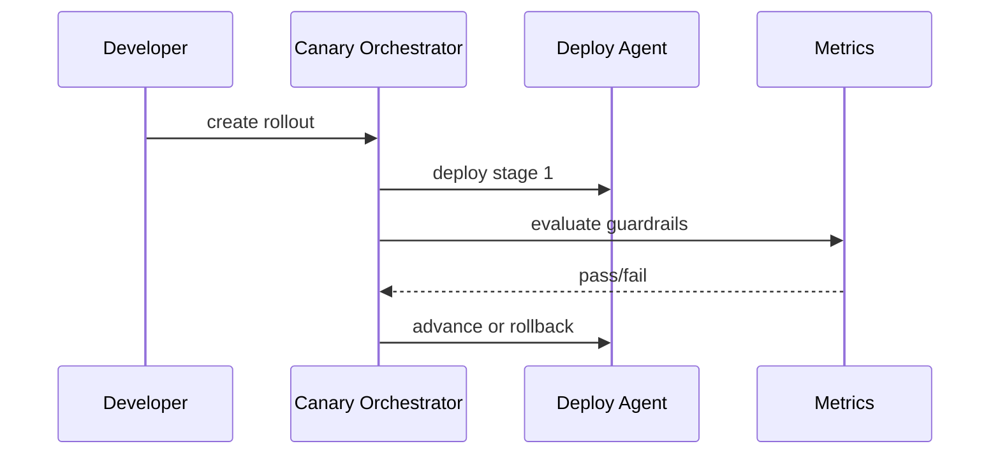

# Design Doc: Canary Deploy Orchestrator

## Background

Meridian runs more than sixty backend services that deploy through a shared release system. The current release system supports manual canaries, but rollout policy is encoded in service-specific scripts. Some teams use a one-region canary for ten minutes. Others use a percentage-based rollout. A few high-risk services require a human to inspect dashboards before proceeding. The lack of a common orchestrator makes releases harder to audit and slows incident response because responders must learn each service's deployment convention during a failure.

The platform team proposes a canary deploy orchestrator that owns rollout state, guardrail checks, and rollback decisions for backend services. Service teams should describe policy declaratively, while the orchestrator executes the rollout and records decisions.

## Goals

The orchestrator should support staged rollout across regions, zones, and traffic percentages. It should let service owners define guardrails using existing metrics and logs. It should automatically pause or rollback when guardrails fail. It should produce an audit trail that explains each rollout step, including the metric values that allowed or blocked progression.

The system should be usable by low-risk services without extensive configuration and strict enough for high-risk services to rely on. The default policy should be safer than the median hand-written policy today.

## Non-Goals

This design does not replace the build system, artifact repository, or service mesh. It does not define business-level experiment analysis. It does not guarantee that every bad release will be caught before reaching customers. The first version will not support mobile apps, database migrations, or long-running data backfills.

## Overview

The orchestrator introduces a rollout controller with a declarative policy file. The controller observes deployment state, evaluates guardrails, and advances or rolls back a release. Services continue to use their existing deployment agents, but agents receive desired state from the controller instead of service-specific scripts.



The controller is intentionally conservative. A missing metric is a failed guardrail unless the policy explicitly marks it optional. A rollout with no owner or expired approval cannot start.

The release object is intentionally small. It does not own build metadata, source control information, or approval comments. Those remain in the systems that already manage them. The orchestrator stores references and the policy snapshot used at the time of rollout, because policy changes after a release starts should not silently alter the release's safety contract.

## Detailed Design

Each service adds a `canary.yaml` file. The file declares stages, guardrails, wait periods, and rollback behavior. The policy is reviewed with the service code so rollout behavior changes are visible.

```yaml
service: billing-ledger
owner: ledger-platform
stages:
  - name: one-zone
    target: us-central1-a
    traffic: 1
    wait: 10m
  - name: regional
    target: us-central1
    traffic: 10
    wait: 20m
guardrails:
  - metric: http_5xx_rate
    max: 0.01
  - metric: p99_latency_ms
    max: 350
rollback:
  automatic: true
```

The rollout controller stores state in a durable table keyed by rollout id. State transitions are append-only: created, deploying, observing, paused, rolling_back, rolled_back, completed. Append-only state is slightly more verbose than mutating a row in place, but it gives incident reviewers a reliable timeline.

Policies are validated at submission time and again before each stage transition. The second validation catches dependencies that have changed since the release started, such as a cluster being removed from the eligible target set. Validation failures pause the rollout and require owner action rather than attempting to infer a safe substitute.

Guardrail evaluation calls the metrics API with a fixed window ending at the current stage's observation deadline. The controller compares treatment metrics to baseline metrics when available. For services without baseline traffic, the controller uses absolute thresholds only. We chose this hybrid because many internal services do not have stable baseline partitions.

For services with very low request volume, percentage-based error thresholds can be noisy. The orchestrator therefore supports a minimum-event guard. A stage can require both an error-rate threshold and a minimum number of requests before advancement. If the minimum is not reached within the hold window, the release pauses with an insufficient-data state rather than advancing on an empty metric.

Rollbacks are issued through the existing deploy agent. The controller never directly changes service mesh weights or Kubernetes objects. This preserves ownership boundaries and keeps deploy agents responsible for environment-specific mechanics.

The orchestrator exposes a CLI:

```bash
canaryctl start --service billing-ledger --artifact sha256:7ca1
canaryctl status rollout-1842
canaryctl pause rollout-1842 --reason "investigating latency"
```

Every command writes an audit event. Human pauses require a reason. Automatic rollbacks include the failing guardrail and observed value.

Manual override requires two pieces of information: the actor and the reason. The reason is free text in the CLI but normalized into a small enum for reporting. The system does not attempt to prevent all risky overrides; it makes them explicit, attributable, and reviewable.

## Alternatives Considered

One alternative was to standardize release scripts while leaving orchestration in each service repo. This would reduce duplication but would not create a single audit model or consistent rollback semantics.

Another alternative was to force all services into a single global rollout policy. That would be simpler operationally and wrong for services with different blast-radius needs. A declarative per-service policy gives flexibility while preserving a common execution engine.

A third alternative was to integrate directly into the service mesh. We rejected that for the first version because deploy agents already encode environment-specific safety checks. The orchestrator should coordinate, not bypass, those agents.

We considered using deploy-time annotations in each service repository as the source of rollout policy. That would keep policy close to code, but it would make emergency policy edits slower and harder to audit across services. Storing policies centrally with repository references gives platform teams one review surface while still letting service owners propose changes through code review.
