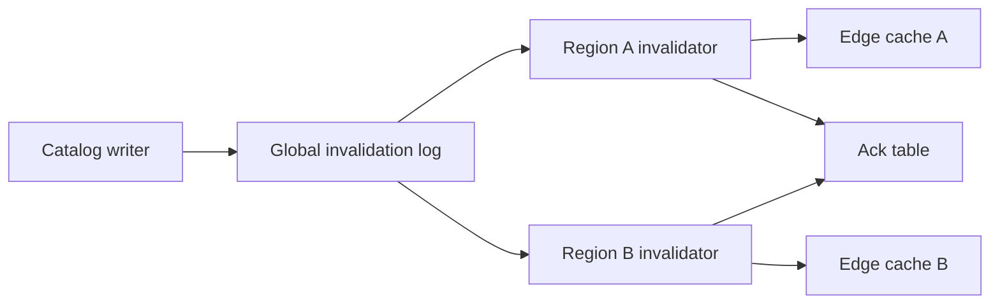

# Design Doc: Multi-Region Cache Invalidation

## Background

Meridian Catalog serves product metadata from regional edge caches. The cache layer keeps read latency low, but invalidation is inconsistent across regions. A catalog update in the primary region usually reaches edge caches within thirty seconds. During regional control-plane delays, some edges can serve stale product titles, prices, or policy flags for several minutes. This is acceptable for low-risk descriptive fields and unacceptable for compliance-sensitive fields.

The current invalidation mechanism broadcasts best-effort messages from the catalog writer. Edge regions subscribe to the stream and evict keys. If a region misses messages, it eventually corrects through TTL expiry. This design was adequate when catalog updates were infrequent. It is now under strain because pricing, availability, and policy flags update continuously.

We need a multi-region invalidation design that distinguishes field risk, gives operators visibility into propagation, and provides bounded staleness for sensitive fields.

## Goals

The system should propagate invalidations to all serving regions with measurable latency. It should support different freshness requirements for different field classes. It should let operators answer whether a specific update reached a specific region. It should preserve low read latency for the common case and avoid turning every cache read into a control-plane dependency.

The design should tolerate temporary regional message loss. A region that falls behind should recover by reconciling missed invalidations rather than waiting only for TTL expiry.

## Non-Goals

This design does not replace the edge cache. It does not make catalog reads strongly consistent across all regions. It does not change the source-of-truth database. It does not address media asset propagation, which has a separate pipeline and different cache semantics.

The first version will not support per-customer invalidation rules. Invalidation operates on catalog object keys and field classes.

## Overview

The proposal adds versioned invalidation records, regional acknowledgements, and a reconciliation loop. Writers publish invalidation records to a durable global log. Each edge region consumes the log, evicts affected keys, and writes an acknowledgement with the highest applied version. A control-plane dashboard reports lag by region and field class.



Sensitive fields, such as policy flags and regulated prices, receive shorter max-staleness budgets. Low-risk fields continue to rely on ordinary invalidation and TTL.

The design assumes that most invalidations are small and field-scoped. Catalog descriptions, availability windows, and policy flags usually change one entity at a time. For rare broad invalidations, the record supports an evict-prefix strategy, but the platform requires an explicit reason and lower rate limits. This prevents broad invalidation from becoming the default operational escape hatch.

## Detailed Design

Each catalog update computes affected cache keys and field class. The writer appends an invalidation record to the global log. The record is immutable and includes object id, field class, version, update time, and invalidation strategy.

```ts
type InvalidationRecord = {
  objectId: string;
  fieldClass: "descriptive" | "availability" | "pricing" | "policy";
  version: number;
  updatedAt: string;
  strategy: "evict-key" | "evict-prefix";
};
```

Edge invalidators consume records in order per object id. They evict cache keys and then write an acknowledgement. Acknowledgement writes are batched to avoid turning every invalidation into a synchronous global write. The batch interval should start at five seconds for policy and pricing fields and thirty seconds for descriptive fields.

Field classes are registered in a small config file owned by the catalog platform team. Registration defines the owning service, maximum record size, allowed invalidation strategy, and default staleness budget. The invalidation service rejects records for unregistered field classes. This is stricter than the current cache API, but it gives operators a way to understand blast radius before an incident.

Readers do not synchronously check the acknowledgement table for every request. Instead, cache entries store the catalog version and field class. For sensitive field classes, the edge cache refuses to serve entries older than the configured max-staleness budget when the region is known to be behind. In that case it falls back to a regional read-through path.

```sql
CREATE TABLE regional_invalidation_ack (
  region STRING,
  field_class STRING,
  highest_version INT64,
  observed_at TIMESTAMP
);
```

The reconciliation loop runs in each region and compares local applied versions with the global log. If a gap is detected, the loop replays missing records. If the gap exceeds the max recovery window, the region marks sensitive caches degraded and routes reads through the read-through path until caught up.

The replay path is deliberately the same path used during normal consumption. There is no separate recovery protocol. A region stores its last applied offset per field class and can request records after that offset. If the log no longer has the offset, the invalidation service returns a typed replay-expired error and includes the recommended field-class flush command in the response metadata.

Operational dashboards show p50, p95, and max propagation lag by field class. Alerts fire when policy or pricing lag exceeds the configured budget for more than two minutes.

The most important alert is not raw invalidation volume; it is sustained regional lag for a field class with a low staleness budget. That combination means users can see stale data for longer than the product contract allows. Volume-only alerts remain informational because large catalog imports can generate legitimate spikes.

## Alternatives Considered

One alternative was to shorten all TTLs. This is simple but expensive and still does not provide observability into whether an update propagated. It also punishes low-risk fields for the needs of high-risk fields.

Another alternative was to make all catalog reads strongly consistent from the source database. That would solve freshness but break latency and availability goals for high-traffic read paths.

A third alternative was region-to-region gossip. Gossip is attractive for resilience, but it makes it harder to provide a clear audit trail for a specific update. A durable global log plus regional reconciliation is easier to reason about and debug.

We considered active-active version assignment for catalog objects. That would reduce dependence on the writer's home region, but conflict resolution would become part of every cache consumer's correctness story. The selected design keeps version assignment centralized while allowing invalidation records to replicate everywhere readers need them.
