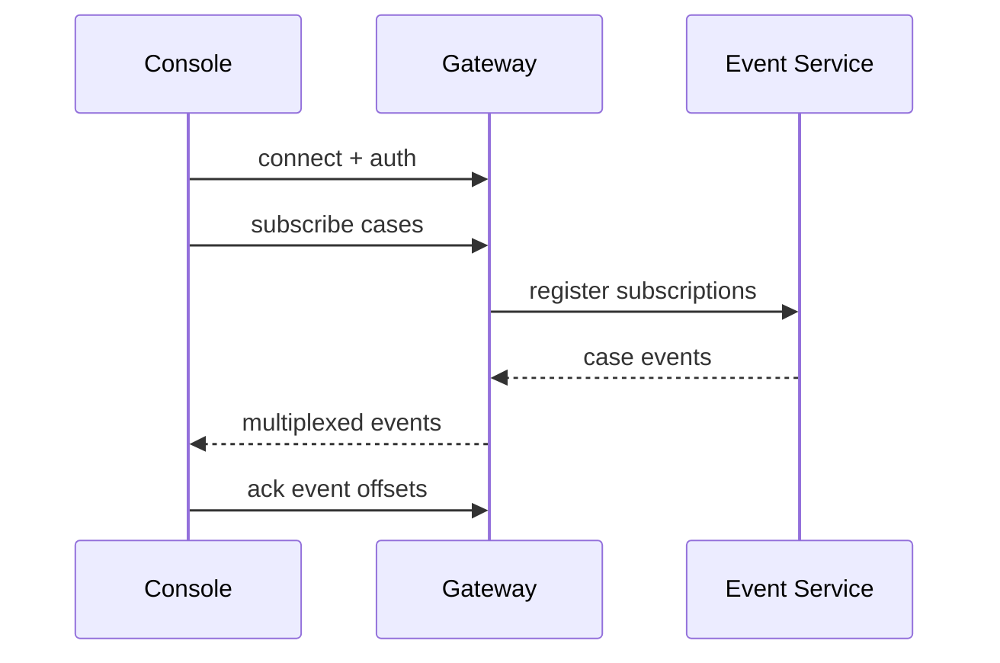

# Design Doc: Bidirectional Streaming Protocol

## Background

Meridian Support Console currently uses polling for live case updates. Agents keep several high-priority cases open while chatting with customers, waiting for tool results, and coordinating with specialists. Polling every few seconds is simple but wasteful. It also creates visible lag when a customer uploads a file or when a specialist changes case status.

The support platform needs a bidirectional streaming protocol for case sessions. The protocol should deliver server events to the agent console and allow the client to send lightweight acknowledgements, presence updates, and typing state. The system must work through enterprise proxies and degrade cleanly when streaming is unavailable.

This document focuses on the application protocol and gateway behavior. It does not prescribe a specific frontend state-management library.

## Goals

The first goal is lower perceived latency for case updates. Agent consoles should receive message, status, assignment, and attachment events within one second under normal network conditions.

The second goal is connection efficiency. A single agent should maintain one stream per active console session, not one connection per case tab. The protocol should multiplex case subscriptions over that stream.

The third goal is recoverability. Clients should resume from the last acknowledged event after network interruption. The system should avoid duplicate user-visible notifications when reconnecting.

The fourth goal is operational clarity. Gateway logs should make it possible to debug dropped streams, resume failures, and backpressure.

## Non-Goals

This design does not replace durable case storage. It does not support arbitrary binary transfer over the stream. Attachments continue to use signed upload URLs. It does not define mobile push notifications or email notifications.

The first version will not support end-to-end encryption between browser and case service beyond existing TLS transport. Payload-level encryption can be revisited after the event model stabilizes.

## Overview

The client opens a WebSocket connection to the support gateway. After authentication, the client sends a subscription message listing active case ids. The gateway validates access, forwards subscriptions to the case event service, and streams events back to the client. The client sends acknowledgements with the highest processed event id per case.



If WebSocket connection fails, the client falls back to long polling using the same event envelope. This keeps the application model consistent.

The protocol is designed around resumption rather than perfect continuous connectivity. Browser tabs sleep, mobile networks flap, and corporate proxies occasionally terminate long-lived connections. A reconnecting client provides the last acknowledged event id for each subscribed case. The gateway can then replay buffered events or instruct the client to perform a snapshot refresh when replay is no longer available.

## Detailed Design

Every protocol message has an envelope with type, session id, sequence id, and payload. Sequence ids are scoped to the stream. Case event ids are scoped to the case and generated by the event service.

```ts
type StreamEnvelope =
  | { type: "subscribe"; sequenceId: number; caseIds: string[] }
  | { type: "ack"; sequenceId: number; offsets: Record<string, string> }
  | { type: "presence"; sequenceId: number; state: "active" | "idle" }
  | { type: "event"; sequenceId: number; caseId: string; eventId: string; payload: CaseEvent };
```

The gateway authenticates the initial connection using the existing session cookie. It revalidates case access on subscription changes. Access checks are cached for one minute to avoid excessive authorization calls when agents switch tabs quickly. A revoked agent session causes the gateway to close the stream with a policy error.

Subscriptions are mutable. An agent can add or remove case ids without opening a new stream. The gateway treats subscription changes as ordinary sequenced messages so that client state and server state remain debuggable. If a subscription is rejected, the gateway returns a typed error for that case and keeps the rest of the stream open.

Backpressure is handled per connection. The gateway maintains an outbound buffer with a fixed limit. If the buffer fills, low-priority presence events are dropped first. Case events are not dropped; if they cannot be delivered, the gateway closes the connection and requires the client to resume through offsets.

The gateway also tracks pressure per case subscription. A single noisy case should not starve updates for quieter cases in the same agent session. If one subscription exceeds its fair-share budget, the gateway can coalesce presence changes and repeated status updates for that case while preserving durable case events.

The client persists acknowledged offsets in memory and periodically in local storage. On reconnect, the client sends offsets for active cases. The event service replays from the next event after the acknowledged id. If the offset is too old, the gateway instructs the client to reload the case from durable storage.

```json
{
  "type": "ack",
  "sequenceId": 42,
  "offsets": {
    "case_123": "evt_998",
    "case_456": "evt_120"
  }
}
```

Observability includes connection duration, reconnect reason, outbound buffer utilization, replay count, and authorization failures. Dashboards should separate client network failures from gateway errors.

The gateway emits a correlation id at connection start and includes it in every structured log. Support engineers can use that id to distinguish three common reports: the stream disconnected, replay failed, or the underlying case state did not change. The protocol should make stale UI reports diagnosable without requiring browser console access.

## Alternatives Considered

Server-sent events were considered because they are simpler for server-to-client updates. They do not support client acknowledgements and presence updates as cleanly, so the design would need a second channel.

Pure long polling was considered as an incremental improvement. It improves compatibility but does not reduce latency or connection churn enough for active support workflows.

Per-case WebSocket connections were rejected because agents often hold multiple cases open. Multiplexing reduces connection count and gives the gateway a single place to manage backpressure.

Exactly-once delivery was also considered. The team rejected it for v1 because the durable case store is already the source of truth and client updates are idempotent by event id. The protocol guarantees ordered delivery while connected and best-effort replay after reconnect. Clients must treat repeated events as possible.

## Open Questions

Should specialist presence be sent over the same stream as case events or through a separate collaboration service? The first version can carry basic presence, but richer collaboration may need separate ownership.

Should acknowledgement offsets be persisted server-side per agent session? Client-provided offsets are simpler, but server persistence could make cross-device resume more reliable.
