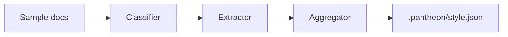

# Design Doc: Evidence-Grounded Packet Generation

## Background

Pantheon generates product packets from local workspace context. The current system is intentionally opinionated: it writes a fixed set of Markdown artifacts with fixed required sections. That default is useful for a first release because it creates a strong quality bar and keeps validation simple. However, real organizations do not share one document shape. A system design review at a large infrastructure company usually expects background, goals, non-goals, proposed design, alternatives, and operational risks. A product leadership packet may prefer a narrative memo with customer impact first. A startup RFC may compress the same thinking into three short sections.

The v2 direction is to preserve Pantheon's grounded generation while making document structure adaptable. The style ingestion engine is the first building block. It reads example documents, extracts observable style features, and saves them as JSON. Later phases can retrieve examples and adjust prompts, but this document only covers deterministic ingestion.

## Goals

The first goal is to produce a useful `StyleProfile` without calling an LLM. The profile should include source documents, artifact type groups, ordered top-level sections, average document depth, voice metrics, diagram conventions, code block density, and example paths. The second goal is to make the profile transparent. Users should be able to open `.pantheon/style.json`, understand what was learned, and make manual edits without reverse-engineering a binary cache.

The third goal is to keep the implementation small. Phase 1 should not modify the generation pipeline, validators, artifact specs, MCP server, or provider adapters. It should add a command, new style modules, and fixtures. The fourth goal is deterministic behavior. Running the command twice on the same folder should produce the same artifact grouping and the same aggregates except for the extraction timestamp.

## Non-Goals

This phase does not generate embeddings. It does not choose the nearest example for a new artifact. It does not rewrite prompts or override required sections during packet generation. It does not validate whether future outputs match the learned style. It also does not attempt semantic classification using hosted models, because the preview should work offline and avoid new dependencies.

We are also not trying to perfectly parse every Markdown dialect. The extractor only needs a practical approximation: h2 headings for sections, fenced blocks for diagrams and code density, image references, and simple word counts. More sophisticated parsing can be considered later if user examples reveal a clear need.

## Overview

The command is `pantheon learn-style <dir>`. The CLI resolves the input directory relative to the current working directory, scans supported text files, classifies each file, extracts style features, groups examples by artifact type, aggregates each group, and writes the profile to the current workspace. Progress logs go to `console.error` with the existing `[pantheon]` prefix.

The profile is intentionally not tied to a run folder. It belongs to the workspace and lives under `.pantheon/style.json`. That location gives future `pantheon run` executions a stable place to look while keeping source documents untouched.

## Detailed Design

Classification starts with filenames because user corpora often have strong naming conventions. Files containing `system-design`, `design-doc`, or `architecture` map to `system-design`; files containing `prd` or requirements language map to `prd`; files containing `launch`, `eval`, `risk`, `roadmap`, and similar markers map to their corresponding Pantheon slugs. If the filename does not provide a confident signal, the classifier scans the first 1000 characters for headings and marker phrases such as `System Design`, `Working Backwards`, `PR/FAQ`, `Goals`, and `Non-Goals`.

Extraction is deliberately simple. The section list is the ordered set of h2 headings. Total words are counted with whitespace splitting. Voice metrics count first-person terms, hedging terms, and a regex approximation of passive voice per 100 words. Diagram convention prefers Mermaid when a Mermaid fenced block exists, then ASCII diagrams, then image references, otherwise none. Code block density is based on fenced block count per thousand words.

Aggregation operates per artifact type. Numeric values are averaged. Diagram and code density use the mode. Sections use the longest common ordered subsequence across examples when enough overlap exists. If the examples diverge heavily, the aggregator chooses the most common single section list, preferring longer lists on ties.

## Alternatives Considered

One alternative was to ask the selected model to summarize style examples directly. That would be more flexible, but it would introduce provider variance and require network or local model availability for a command that should be cheap and instant. Another alternative was to import a Markdown parser. That may eventually be worthwhile, but the current project has no test framework and only a few dependencies. A regex-based extractor is sufficient for Phase 1 and easier to inspect.

We also considered storing the profile in the output run folder. That makes run provenance obvious, but it makes future style-aware generation awkward because the profile is meant to be a workspace setting rather than an artifact from one generation.
